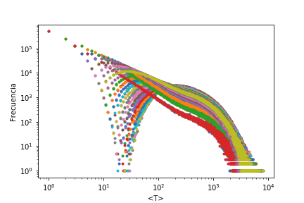

# Computational Statiscal Physics

## [Caminantes Aleatorios](https://en.wikipedia.org/wiki/Random_walk)

Lo primero que simulamos es un caminante aleatorio en una dimension donde la densidad de probabilidad esta dada por la ecuación.

$$\frac{\partial \Psi}{\partial t} = \frac{1}{2}C\frac{\partial^2\Psi}{\partial x^2}$$

Donde C es la constante de difusion.

La solucion a esta ecuación es lo que conocemos como **Ecuación de Difusión**:

$$\Psi(x,t) = \frac{1}{\sqrt{2 \pi ct}}e^{\frac{-x^2}{2ct}}$$

Los codigos de esta simulacion son:

- [Random_Walk](https://github.com/Mahonry/StatiscalPhysics/blob/main/Random_Walk.cpp): Simula un caminante aleatorio en un una dimension, basado en un número aletorio de una distribución gaussiana, regresa un archivo con las posiciones del caminante en X.

- [Random_Walk_Ensemble](https://github.com/Mahonry/StatiscalPhysics/blob/main/Random_Walk_Ensemble.cpp): Simula un ensamble de caminantes aleatorios en un una dimension, basados en un número aletorio de una distribución gaussiana, regresa un archivos con las posiciones X en el ensamble al tiempo t.

## [Cadenas de Markov](https://es.wikipedia.org/wiki/Cadena_de_M%C3%A1rkov)

Para un proceso Markoviano el sistema evolucion con una ecuación maestra de la forma:

$$P_{ij}(t+1) = \sum_{l = 1}^NP_{il}(t)\omega _{l \rightarrow j}$$

O escrita en forma matricial:

$$\vec{P}(t+1) = \vec{P}(t)\widehat{\omega}$$

$$\vec{P}(t) = \vec{P}(0)\widehat{\omega}^t$$

El proceso markoviano simulado es uno de dos estados representado por la siguiente cadena:

   

Para el sistema la matriz de transición se escribe como:

$$\widehat{W} = 
    \begin{bmatrix}
    1-P & P \\
    q & 1-q
    \end{bmatrix}
$$

El proceso simulado tiene solución analítica para los tiempos medios de primer paso $\langle T_{ij} \rangle$, los cuales estan dados por:

$$
    \langle T_{ij} \rangle = 
    \begin{bmatrix}
    \langle T_{0 \rightarrow 0} \rangle & \langle T_{0 \rightarrow 1} \rangle \\
    \langle T_{1 \rightarrow 0} \rangle & \langle T_{1 \rightarrow 1} \rangle
    \end{bmatrix} 
$$

$$ \langle T_{ij} \rangle = 
    \begin{bmatrix}
    \frac{P + q}{q}  & \frac{1}{P} \\
    \frac{1}{q} & \frac{P + q}{q}
    \end{bmatrix} $$

Para simular este proceso, los códigos son:

- [FST_first_step_time](https://github.com/Mahonry/StatiscalPhysics/blob/main/FST_first_step_time.cpp): Barre las probabilidades de **P** desde 0.01 hasta 0.5, nos devuelve un archivo que contiene la probabilidad y los tiempos de primer paso, es decir, los tiempos de pasar del estado 0 al estado 1 para cada una de las probabilidades. Con base en estos resultados podemos calcular el tiempo medio de primer paso.

- [FRT_first_return_time](https://github.com/Mahonry/StatiscalPhysics/blob/main/FRT_first_return_time.cpp): Barre las probabilidades de **P** desde 0.01 hasta 0.5, nos devuelve un archivo que contiene la probabilidad y los tiempos de primer restorn, es decir, los tiempos de pasar del estado 0 y regresar al estado 0 para cada una de las probabilidades. Con base en estos resultados podemos calcular el tiempo medio de primer retorno.

- [Two_level_FST](https://github.com/Mahonry/StatiscalPhysics/blob/main/Two_Level_FST.cpp): Incorpora y simplifica los dos códigos anteriores, donde el parametro target nos indica el proceso a calcular (ya sea primer paso o retorno).

### Caminante aleatorio en un anillo

El siguiente caso de estudio, es el de un caminante aletorio dentro de un anillo, donde el caminante comienza en un nodo aletorio y apartir de ahi tiene igual probabilidad de pasar a alguno de sus vecinos, la estructura considerada se muestra en la siguiente imagen:

   

En la imagen se muestra un anillo de 10 nodos, sin embargo, el caminante fue simulado en una red de 50 nodos, nuevamente el obejtivo fue medir los tiempos medios de primer paso $\langle T_{ij} \rangle$, en este caso tenemos que la expresion analitica que describe este proceso esta dada por:

$$
\langle T_{ij} \rangle = N \left[ \delta_{ij} +\frac{1}{N}\sum_{ l = 2}^N \frac{1-Cos(\phi_l(i-j))}{1-Cos(\phi_l)} \right]
$$

Con $N$ = número de nodos y

$$
\phi_l = \frac{2 \pi}{N}(l - 1)
$$

El resultado de la simulación de los tiempos medios de primer paso, por nodo, se muestra en la siguiente figura.:

   

El codigo que genera la simulación es:  [Caminante_Aleatorio_Anillo](https://github.com/Mahonry/StatiscalPhysics/blob/main/Caminante_Aletorio_Anillo.cpp).

Otro resultado producto de la simulacion es el conteo de frecuencias de los tiempos por nodo, recordemos que el tiempo medio de primer paso $\langle T_{ij} \rangle$, es un promedio sobre experimentos repetidos que evaluan el tiempo de llegar del nodo $i$ al nodo $j$, por lo tanto podemos sacar la distribución de probabilidad de estos, estas distribuciones se encuentran en la sigueinte figura:

   

### Caminante aleatorio en una red

Una vez teniendo los resultados para caminantes en un anillo, podemos generalizar el concepto a cualquier tipo de red, el siguiente paso es entonces simular caminantes aletorios dentro de redes con cualquier topologia, en este caso se ha elegido una red de [Barabassi-Albert](https://es.wikipedia.org/wiki/Modelo_Barab%C3%A1si%E2%80%93Albert) con 100 Nodos, similar a la mostrada a continuación:

   

Es importante mencionar que podemos tener distintos tipos de caminantes aletorios dentro de una red, dependiendo de de como se defina la matriz de pesos (o transición), en este caso simulemos el caso mas simple, donde la matriz de pesos esta dada por:

$$
\omega_{i \to j} = \frac{A_{ij}}{K_i}
$$

Con $A_{ij}$ la matriz de adjacencia y $K_i$ el grado del nodo i, el cual estra dado por:

$$
K_i = \sum_{l=1}^N A_{il}
$$

Otra consideracion importante es que la red sea simple, es decir, que cumpla con:

$$1. A_{ij} = A_{ji}\\
2. A_{ii} = 0
$$

Antes de calcular los tiempos medios de primer paso $\langle T_{ij} \rangle$ o tiempos medios de primer retorno $\langle T_{ii} \rangle$, busquemos la distribución estacionaria $P_j^{\infty}$, de manera intuitiva podemos pensar en la distribución estacionaria como la probabilidad de que el caminante visite el nodo $i$ cuando $t \to \infty$. Definimos entonces a la distribución estacionaria como:

$$P_j^{\infty} = lim_{t\to \infty}  \frac{1}{T} \sum_{t=0}^T P_{ij}(t) $$

Partiendo de la ecuación maestra:

$$P_{ij}(t+1) = \sum_{l=1}^N P_{il}\omega_{l \to j}$$

Es posible escribir una relación de balance detallado (Para un caminante aleatorio en una red dirigida que cumpa los puntos mencionados anteriormente) de la forma:

$$K_iP_{ij}(t) = K_jP_{ji}(t)$$

Si tomamos la distribución estacionaria de esta ecuación de balance detallado, tenemos que:

$$K_iP_{j}^\infty = K_jP_{i}^\infty$$

Tomando la suma sobre todos los nodos a ambos lados.

$$\sum_i^N K_i P_j^\infty = K_j \sum_i^N P_i^\infty$$

Dado que $\sum_i^N P_i^\infty$ es una suma sobre probabilidades, esta cantidad vale 1, de esta forma encontramos que la distribución estacionaria es:

$$P_j^\infty = \frac{K_j}{\sum_{l=1}^NK_l}$$

Esta relación es importante ya que el teorema de KAC, nos dice que el tiempo medio de primer retorno es inversamente proporcional a esta cantidad, en concreto, el resultado es:

$$\langle T_{ii} \rangle = \frac{1}{P_i^\infty}$$

Nuestro primer objetivo es comprobar la ecuación para distribución estacionaria $P_j^\infty $, para esto, el código, [Caminante_aleatorio_red_1.cpp](./Caminante_aleatorio_red_1.cpp)
corre un caminante aleatorio sobre la red prueba y guarda la frecuencia de los nodos visitados.  De la cual obtenemos la siguiente distribución.

   

Si comparamos este resultado simulado con el téorico $P^{\infty}_j = \frac{K_j}{\sum_{l=1}^N K_l}$ vemos que empatan correctamente.

   

Si vemos la distribución estacionaria simulada ($P_i^{\infty}(MC)$) en función del grado del nodo obtenemos una recta. 

   

Ahora estamos en condiciones de obtener el tiempo medio de primer retorno $\langle T_{ii} \rangle$, graficando la simulación contra el inverso de la distribución estacionario obtenemos una recta, de pendiente 1. El código que genera la simulación es [FirstReturn_red](./FirstReturn_red.cpp)

   

El tiempo medio de primer paso $\langle T_{ij} \rangle$, para la red que estamos simulando, es menos trivial, a pesar de que tiene solución analítica, esta está dada en términos de los eigenvectores y eigenvalores derechos e izquierdos de la matriz estocástica de transición $\omega$. 

De forma que, los eigenvalores y eigenvectores estan definidos por:

$$\omega \ket{\phi_l} = \lambda_l \ket{\phi_l}$$
$$\bra{\bar{\phi_l}}\omega = \lambda_l \bra{\bar{\phi_l}}$$

Con esto la expresión analitica para el $\langle T_{ij} \rangle$ esta dada por:

$$\langle T_{ij} \rangle = \frac{1}{P_j^\infty} \left[ \sum_{l=2}^N \frac{1}{1-\lambda_l}\left(\braket{j|\phi_l} \braket{\bar{\phi_l}|j} - \braket{i|\phi_l} \braket{\bar{\phi_l}|i}\right)\right]$$